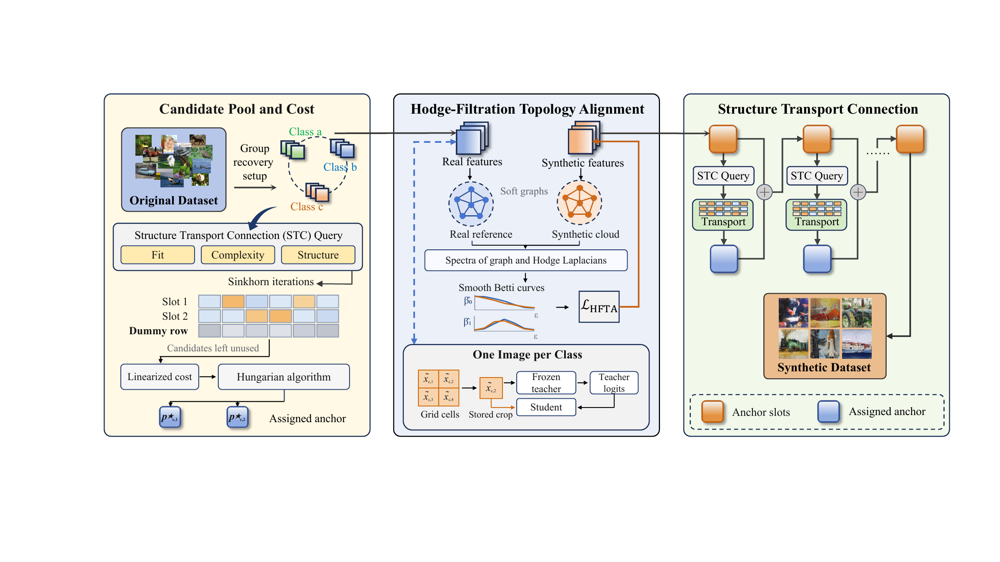

<div align="center">

# RETA++

**Retrieval and Structure Transport Alignment for Dataset Distillation**

**Muquan Li** · **Hang Gou** · **Tao He**
University of Electronic Science and Technology of China


</div>

---

Official PyTorch implementation of **RETA++**. From a frozen teacher we recover a compact
dataset, assign **distinct real anchors** to same-class synthetic slots with **Structure
Transport Connection (STC)**, and preserve class geometry with **Hodge-Filtration Topology
Alignment (HFTA)**. At one image per class, four jointly recovered cell slots are packed into
a single image and replayed with cell-aligned crops.

<p align="center">
  
</p>

---

## Table of Contents

- [Highlights](#highlights)
- [Pipeline at a Glance](#pipeline-at-a-glance)
- [Repository Layout](#repository-layout)
- [Installation](#installation)
- [Data and Checkpoints](#data-and-checkpoints)
- [Quick Start](#quick-start)
- [Running Individual Stages](#running-individual-stages)
- [Configuration Reference](#configuration-reference)
- [Outputs and Logs](#outputs-and-logs)
- [Experiments](#experiments)
- [Diagnostics and Efficiency](#diagnostics-and-efficiency)
- [Testing](#testing)
- [Citation](#citation)
- [Acknowledgments](#acknowledgments)
- [License](#license)

---

## Highlights

- **Frozen-teacher recovery.** Synthetic pixels are optimized against teacher cross-entropy
  and batch-normalization statistics, with the teacher forward pass kept differentiable with
  respect to the synthetic images.
- **Structure Transport Connection (STC).** A capacity-constrained, structure-aware transport
  problem selects *distinct* real anchors for each active slot; selection is per group and never
  averages patches barycentrically.
- **Hodge-Filtration Topology Alignment (HFTA).** Weighted graph/Hodge spectra and corrected
  first-order Betti responses align the synthetic class cloud with a fixed real reference.
- **Cell slots at IPC = 1.** A `grid_side = 2` image stores four jointly recovered cells whose
  exact crop state, flip, and bounding box are cached during relabeling and replayed during
  student training.
- **Decoupled, resumable pipeline.** Recovery, relabeling, student training, and evaluation are
  separate stages; completed classes and epochs are skipped on restart and the resolved
  configuration is pinned in `run.json`.
- **Ablation-ready.** `--set key=value` switches assignment (`stc`, `independent`, `balanced`,
  `static`, `none`) and topology (`hfta`, `pta`, `none`) without editing code.

---

## Pipeline at a Glance

```text
        frozen teacher                       distilled dataset              fresh student
 ┌───────────────────────┐   STC + HFTA   ┌──────────────────────┐   replay   ┌───────────────┐
 │  real training split  │ ─────────────► │  synthetic/*.png     │ ─────────► │  train on     │
 │  (per class pool)     │   recover      │  + cached logits &   │            │  cached views │
 └───────────────────────┘                │    crop states       │            └───────┬───────┘
                                          └──────────────────────┘                    │
                                                    relabel                           ▼
                                                                         dev-split preset selection
                                                                                    │
                                                                                    ▼
                                                                           test-set evaluation
```

`python -u run.py all ...` runs `recover → relabel → train → evaluate` in sequence. Each stage
can also be invoked on its own (see [Running Individual Stages](#running-individual-stages)).

---

## Repository Layout

```text
root/
├── run.py                  # unified entry point (recover / relabel / train / evaluate / all)
├── train_teacher.py        # supervised teacher training on the class-stratified split
├── recover.py              # stage shims: run.py recover
├── relabel.py              # stage shims: run.py relabel
├── validate.py             # stage shims: run.py train
├── configs/
│   └── paper.json          # default configuration (overridable with --set)
├── retapp/                 # core library
│   ├── cli.py              #   argument parsing and stage drivers
│   ├── config.py           #   configuration schema, datasets, students, presets
│   ├── data.py             #   dataset views and fixed development splits
│   ├── models.py           #   teacher/student models and frozen-teacher stats
│   ├── recovery.py         #   grouped pixel recovery with residual anchors
│   ├── transport.py        #   STC: Sinkhorn transport and exact anchor assignment
│   ├── topology.py         #   HFTA: graph/Hodge spectra and Betti responses
│   ├── pta.py              #   PTA component ablation (persistent topology alignment)
│   ├── replay.py           #   exact crop-state replay and cell packing
│   ├── training.py         #   relabeling, preset selection, student training
│   ├── diagnostics.py      #   anchor-sharing and topology-gradient measurements
│   ├── plugin.py           #   STC/HFTA hooks for external recovery loops
│   └── runtime.py          #   seeding, logging, atomic checkpointing
├── tools/                  # experiment launcher and analysis scripts
├── tests/                  # pytest suite
├── vendor/                 # vendored CIFAR ResNet (from the FADRM codebase)
└── docs/                   # METHOD.md, EXPERIMENTS.md, framework figure
```

### Library modules

| Module | Responsibility |
| --- | --- |
| `retapp/config.py` | `Config` dataclass, dataset sizes, student list, LR/schedule presets, validation |
| `retapp/data.py` | `Source`, `RealView`, `ImageSet`, class-stratified `split_indices` |
| `retapp/models.py` | `build_model`, `load_weights`, normalization, `Teacher` statistics |
| `retapp/recovery.py` | Recovery loop, candidate pool construction, residual injection schedule |
| `retapp/transport.py` | Sinkhorn solver, Gromov-style structure cost, Hungarian anchor assignment |
| `retapp/topology.py` | Incidence operators, heat-trace responses, `ClassTopology` cache |
| `retapp/replay.py` | `Crop` state, crop application, 2×2 cell packing, batch replay |
| `retapp/training.py` | `relabel`, `select_preset`, `train_student`, accuracy |
| `retapp/plugin.py` | `RecoveryPlugin` embedding STC/HFTA into host recoveries |

---

## Installation

**Option A — Conda (recommended).** Creates the `retapp` environment with a CUDA 12.1 build:

```bash
conda env create -f environment.yml
conda activate retapp
```

**Option B — pip** into an existing Python 3.11 environment:

```bash
pip install -r requirements.txt
```

Pinned versions: `torch==2.4.1`, `torchvision==0.19.1`, `numpy==1.26.4`, `scipy==1.14.1`,
`pillow==10.4.0`, `gudhi==3.13.0`, `pytest==8.3.3`. A CUDA-capable GPU is recommended for
recovery and student training; the code falls back to CPU automatically when CUDA is
unavailable (`--device` selects explicitly).

---

## Data and Checkpoints

Place datasets and teacher checkpoints in the following layout. CIFAR datasets use the original
torchvision layout; other datasets use class folders with identical class names in `train` and
`val`.

```text
data/
  cifar100/cifar-100-python/...
  imagenette/
    train/<class>/*.JPEG
    val/<class>/*.JPEG
  tiny_imagenet/
    train/<class>/...
    val/<class>/...
checkpoints/
  cifar100/resnet18.pth
  imagenette/resnet18.pth
```

ImageNet-1K, ImageWoof, ImageFruit, ImageYellow, ImageMeow, and ImageSquawk use the same folder
convention. Checkpoints may contain a plain state dictionary, a `state_dict` entry, or a `model`
entry. The classifier and class order must match the dataset.

The fixed, class-stratified development split holds **50 images per class for ImageNet-1K** and
**10% per class for the other datasets** (`split_seed = 42`). It is excluded from recovery pools
and used only for student preset selection; the test set is read solely by evaluation.

---

## Quick Start

Train a teacher, then recover and evaluate a distilled dataset end to end:

```bash
# 1. Train a teacher on the training portion of the fixed split
python -u train_teacher.py --dataset imagenette --data data/imagenette \
  --architecture resnet18 --output checkpoints/imagenette/resnet18.pth

# 2. Recover, relabel, train, and evaluate with a single command
python -u run.py all --dataset imagenette --ipc 10 --seed 42 \
  --data data/imagenette --teacher-checkpoint checkpoints/imagenette/resnet18.pth \
  --output outputs/imagenette_ipc10_seed42 --students resnet18
```

The same command supports CIFAR-100 and IPC = 1:

```bash
python -u run.py all --dataset cifar100 --ipc 1 --seed 42 \
  --data data/cifar100 --teacher-checkpoint checkpoints/cifar100/resnet18.pth \
  --output outputs/cifar100_ipc1_seed42 --students resnet18
```

For CIFAR-100, `--download` on `train_teacher.py` fetches the dataset through torchvision.

At IPC = 1, cell-slot recovery and exact crop replay are enabled automatically, and each class
still saves exactly one image. For larger budgets, the active group contains at most four images
and the HFTA class cloud contains at most 32 slots. Additional architectures can be evaluated by
passing multiple names to `--students`.

---

## Running Individual Stages

Each stage reads the configuration saved by recovery, so they can be run and resumed
independently:

```bash
python -u run.py recover  --dataset imagenette --ipc 10 \
  --data data/imagenette --teacher-checkpoint checkpoints/imagenette/resnet18.pth \
  --output outputs/imagenette_ipc10_seed42

python -u run.py relabel  --output outputs/imagenette_ipc10_seed42 \
  --teacher-checkpoint checkpoints/imagenette/resnet18.pth

python -u run.py train    --output outputs/imagenette_ipc10_seed42 --students resnet18

python -u run.py evaluate --output outputs/imagenette_ipc10_seed42 --students resnet18
```

Student training evaluates four learning-rate/schedule presets on the development split, and
`evaluate` loads the selected checkpoint and evaluates it on the test set. The convenience
scripts `recover.py`, `relabel.py`, and `validate.py` are thin wrappers around the corresponding
`run.py` stages.

### CLI reference

| Stage | Command |
| --- | --- |
| Recover synthetic images | `run.py recover` |
| Cache teacher logits and crop states | `run.py relabel` |
| Train students and select a preset | `run.py train` |
| Evaluate the selected checkpoint | `run.py evaluate` |
| Run all four stages in order | `run.py all` |

| Global option | Description | Default |
| --- | --- | --- |
| `--config` | Base configuration file | `configs/paper.json` |
| `--dataset` | Dataset name (see [Configuration](#configuration-reference)) | `imagenette` |
| `--ipc` | Images per class | `10` |
| `--seed` | Experiment seed | `42` |
| `--teacher` | Teacher architecture | `resnet18` |
| `--teacher-checkpoint` | Teacher checkpoint path | — |
| `--data` | Dataset root | — |
| `--output` | Run output directory (required) | — |
| `--device` | `cuda` or `cpu` | auto-detected |
| `--workers` | DataLoader workers | `4` |
| `--students` | Student architectures | `resnet18` |
| `--presets` | Training presets to evaluate | all four (`S1`–`S4`) |
| `--set KEY=VALUE` | Override a config field (JSON value) | — |
| `--class-start` / `--class-end` | Recover a class range | `0` / all |
| `--print-config` | Print the resolved config and exit | off |

---

## Configuration Reference

The defaults live in `configs/paper.json`. Any field may be overridden during recovery with
`--set key=value`; the resolved values are written to `run.json` and reused by later stages.

| Paper setting | Configuration field | Default |
| --- | --- | --- |
| Image budget K | `ipc` | 10 |
| Recovery budget B | `recovery_steps` | 300; 2000 for CIFAR-100/Tiny-ImageNet at IPC=1 |
| Pixel learning rate | `recovery_lr` | 0.25, cosine decay |
| Residual ratio alpha | `alpha` | 0.5 |
| BN weight | `bn_weight` | 0.01 |
| Maximum image-slot group | `group_size` | 4 |
| Candidate count M | `candidates` | 32 |
| Complexity coefficient | `complexity_weight` | 0.1 |
| Structure coefficient | `structure_weight` | 0.2 |
| Entropy zeta | `entropy` | 0.05 |
| Alternating updates R | `transport_updates` | 3 |
| HFTA weight | `hfta_weight` | 0.5 |
| Filtration scales | `hfta_scales` | 8 |
| Soft-edge temperature / scale spacing | `tau_fraction` | 0.5 |
| Spectral bandwidth / positive eigenvalue mean | `rho_fraction` | 0.05 |
| Class-cloud cap | `cloud_cap` | 32 |
| Real-reference subsamples Q | `reference_samples` | 20 |
| Topology/cache interval | `topology_every` | 10 |
| IPC=1 grid | `grid_side` | 2, giving four cell slots |
| Residual injection blocks | `blocks` | 4 |
| Sinkhorn iterations / tolerance | `sinkhorn_iterations` / `sinkhorn_tolerance` | 1000 / 1e-7 |

`recovery_steps = 0` and `epochs = 0` select dataset defaults. The student default is 1000 epochs
for CIFAR and for Tiny-ImageNet at IPC = 1, and 300 otherwise. Image resolution is 32 for CIFAR,
64 for Tiny-ImageNet, and 224 for the ImageNet-family datasets. See
[Method and Configuration](docs/METHOD.md) for the full mapping between paper notation and code.

---

## Outputs and Logs

```text
outputs/<setting>/
  run.json                        # resolved configuration, teacher checksum, class order
  split.json                      # recovery/development indices
  synthetic/<class>/image_*.png
  labels/epoch_*/batch_*.pt        # teacher logits and exact crop states
  students/<architecture>/<preset>/student.pt
  diagnostics/class_*.pt
  results/<architecture>.json
  logs/recovery.output.txt
  logs/relabel.output.txt
  logs/<architecture>_<preset>.output.txt
```

Logs are flushed during execution. For example,
`tail -f outputs/imagenette_ipc10_seed42/logs/recovery.output.txt` follows recovery. Restarting
the same recovery skips completed classes, and relabeling skips completed epochs. Use a new
output directory whenever the configuration changes, since a mismatched `run.json` is rejected.

---

## Experiments

Print the commands for the main study, or add `--execute` to launch them sequentially:

```bash
python tools/experiments.py main --data-root data --teachers checkpoints
python tools/experiments.py main --data-root data --teachers checkpoints --execute
```

The launcher also supports `high-ipc`, `cross`, `components`, `assignment`, `packed`,
`stc-sweep`, `hfta-sweep`, and `group-pool`. By default it runs seeds 42–46, with a separate
output directory for every setting and seed.

```bash
python tools/diagnose.py --run outputs/imagenette_ipc10_seed42
python tools/efficiency.py --run outputs/imagenette_ipc10_seed42
python tools/collect_results.py --root outputs --output summary.json
```

See [Experiment Commands](docs/EXPERIMENTS.md) for ablations, corruption evaluation, continual
learning, and plug-in integration. [Method and Configuration](docs/METHOD.md) maps the paper
notation to the implementation and lists the recovery defaults.

---

## Diagnostics and Efficiency

- `tools/diagnose.py` reports shared-anchor fraction, synthetic-to-real feature spread,
  anchor-direction cosine median, integrated hard-Betti deficit, topology-gradient coverage, and
  weak-image fraction for a completed run.
- `tools/efficiency.py` sums class recovery durations — including pool and reference preparation —
  and reads peak CUDA allocation. Teacher training, relabeling, and student training are outside
  that timing; run the full recovery in one process on one device for a single-run memory
  measurement.

---

## Testing

```bash
python -m pytest
```

The suite covers capacity marginals, distinct anchor assignment, corrected Hodge responses,
pixel gradients, class-cache handling, cell replay, relabel-cache consistency, and
development-based student selection.


---

## Acknowledgments

The residual-recovery pipeline builds on FADRM and RETA. We use PyTorch and torchvision for
models and image transforms, SciPy for linear assignment and numerical optimization, and GUDHI
for persistent-homology ablations. The README organization follows
[Matching Training Trajectories](https://github.com/georgecazenavette/mtt-distillation). See
[Third-Party Notices](THIRD_PARTY.md) and [LICENSE](LICENSE).

## License

Released under the [MIT License](LICENSE). `vendor/cifar_resnet.py` retains its original FADRM
copyright notice; dependencies retain their respective licenses.
